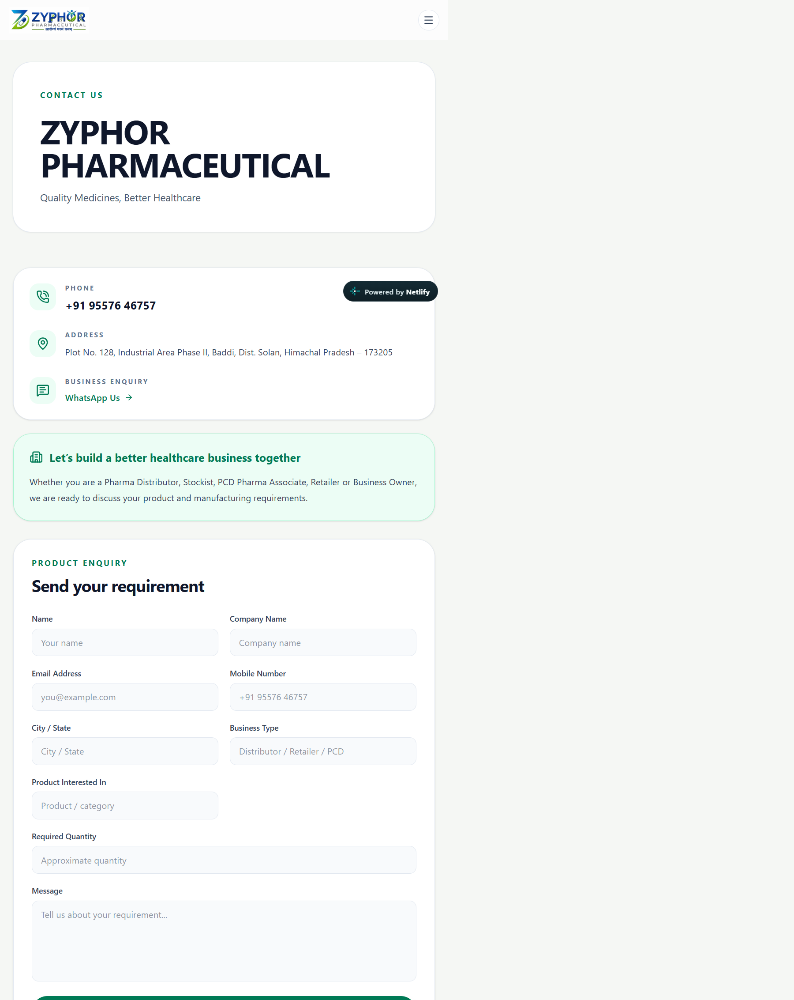

# Zyphor Pharmaceutical

Zyphor Pharmaceutical's company and product portfolio website. It presents the pharmaceutical, nutraceutical, and Ayurvedic range, along with PCD and third-party manufacturing enquiries.

**Live website:** [zyphor-pharmaceuticals.netlify.app](https://zyphor-pharmaceuticals.netlify.app/)
**GitHub:** [prabhteshmishra4567/Zyphor](https://github.com/prabhteshmishra4567/Zyphor)

## What visitors can do

- Browse the product portfolio by name and category.
- Open product details to read the available description, benefits, composition, directions, and precautions.
- Enquire about a specific product through WhatsApp; the product name is included in the prefilled message.
- Submit a business or product enquiry with contact details. Netlify Forms stores the submission, then opens WhatsApp with the enquiry details prefilled. The visitor reviews the draft and taps **Send** in WhatsApp to deliver it.
- Contact Zyphor by phone or WhatsApp from the contact page.

## Screenshots

### Homepage


### Product portfolio


### Product details


### Enquiry form


## Technology

- Next.js App Router, React, and TypeScript
- Tailwind CSS
- Netlify Next.js Runtime and Netlify Forms

## Run locally

```bash
npm ci
npm run dev
```

Open [http://localhost:3000](http://localhost:3000).

## Build for production

```bash
npm run build
npm start
```

The Netlify site deploys from `main`. Form detection must remain enabled in Netlify for enquiry submissions to be collected. Configure a Netlify form notification if enquiries should also be emailed.

## Assets and limitations

Product images are in `public/products`; the company logo is `public/logo.jpeg`. Local environment files are excluded from Git.

Account, admin, cart, checkout, and payment flows are disabled until real authentication, persistent storage, and a payment provider are configured. They must not be treated as active services.
